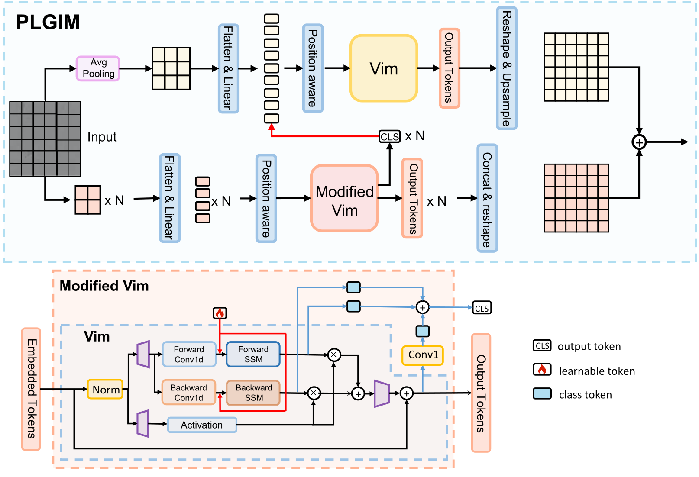

# PLGMNet: Parallel Local-Global Mamba Network for Real-Time Steel Surface Defect Detection



**PLGMNet** is a lightweight real-time segmentation network for steel surface defect detection. It introduces the **Parallel Local-Global Information Mamba (PLGIM)** layer, which combines local window-based Mamba and global pooling-based Mamba in parallel to efficiently capture both fine-grained details and global context.

## Highlights

- **Parallel Local-Global Mamba (PLGIM)** — A novel dual-branch State Space Model layer that processes local windows and global context simultaneously via bidirectional Mamba blocks.
- **Lightweight & Real-Time** — Built with depthwise separable convolutions and efficient SSM blocks, achieving high FPS on a single GPU.
- **Multi-Scale Edge Guidance Module (MEGM)** — Fuses multi-scale features with depthwise conv, max/average pooling, and gating mechanisms.
- **Deep Supervision** — Five auxiliary outputs at different scales for improved gradient flow and convergence.
- **Hybrid Loss** — Combines BCE, SSIM, IoU, and Contrast Erasure Loss (CEL) for precise boundary and region segmentation.
- **Flask Web Demo** — Interactive web interface for uploading images and visualizing predictions.

## Requirements

| Package | Version |
|---------|---------|
| Python | 3.12+ |
| PyTorch | 2.3.1+cu118 |
| torchvision | 0.18.1+cu118 |
| mamba-ssm | 2.2.2 |
| timm | 1.0.22 |
| Flask | 3.1.2 |
| OpenCV | 4.10+ |
| Pillow | 12.0+ |
| einops | 0.8.1 |
| NumPy | 2.3+ |
| SciPy | 1.16+ |
| thop | 0.1.1 |
| tqdm | 4.66+ |
| Matplotlib | 3.8+ |

See [`requirements.txt`](requirements.txt) for the full list.

## Installation

```bash
# Clone the repository
git clone https://github.com/your-username/PLGMNet.git
cd PLGMNet

# Install dependencies
pip install -r requirements.txt
```

> **Note:** `mamba-ssm` requires a CUDA toolkit and C++ compiler. If installation fails, follow the [official mamba-ssm guide](https://github.com/state-spaces/mamba) or install from source.

## Project Structure

```
PLGMNet/
├── model/                  # Core model definitions
│   ├── PLGMNet.py          # Main network architecture (encoder + decoder)
│   ├── mymodules.py        # PLGIM, CBAM, MEGM, Local/Global Mamba layers
│   ├── vssblock.py         # VMamba SS2D selective scan and VSS block
│   └── transformer.py      # Custom multi-head attention / ViT blocks
├── loss/                   # Loss functions
│   ├── hybridloss.py       # BCE + SSIM + IoU + CEL composite loss
│   ├── CEL.py              # Contrast Erasure Loss and IoU loss
│   └── pytorch_ssim/       # SSIM / LogSSIM implementation
├── utils/                  # Utilities
│   ├── dataset.py          # Custom PyTorch dataset loader
│   ├── joint_transforms.py # Data augmentations (flip, rotate, blur, crop)
│   ├── sod_metrics.py      # F-measure, MAE, S-measure, E-measure, weighted F
│   ├── model_init.py       # Random seed + Xavier initialization
│   ├── tensor_ops.py       # Upsampling helpers and channel shuffle
│   └── FPS.py              # FPS benchmark, FLOPs and parameter counting
├── data/                   # Dataset and file lists
│   ├── train.txt           # Training image-mask pairs
│   ├── test.txt            # Test image-mask pairs
│   └── txt_create.py       # Script to generate file lists
├── save/                   # Checkpoint storage
│   └── PLGMNet.pth         # Pretrained weights
├── figure/                 # Architecture diagrams
├── app.py                  # Flask web inference server
├── train.py                # Training script
├── test.py                 # Evaluation script
└── requirements.txt
```

## Architecture

PLGMNet follows a U-Net-like encoder-decoder design with five stages:

**Encoder** — 5-stage downsampling using DSConv3x3 (depthwise separable conv, stride=2). Channel progression: 3 → 16 → 32 → 64 → 96 → 128. Each stage (2–5) includes a PLGIM layer after the downsampling convolution.

**PLGIM Layer** (core contribution):
- **Local branch** — Divides the feature map into windows, flattens each into a sequence, and processes it with forward + backward Mamba blocks. A learnable class token aggregates window-level features.
- **Global branch** — Pools the feature map globally, flattens it into a sequence, and processes it with forward + backward Mamba blocks to capture long-range dependencies.
- Outputs from both branches are concatenated and fused via 1×1 convolution.

**Decoder** — Top-down progressive fusion. At each level, the upsampled higher-level feature is added to the corresponding encoder feature (with a CBAM attention gate and refinement convolution). A MEGM module fuses each pair. Five output layers (conv + sigmoid) produce predictions at all scales, all upsampled to the input resolution.

## Dataset

The dataset contains steel surface images with binary defect masks.

| Split | Images | Directory |
|-------|--------|-----------|
| Train | 3,600 | `data/Train/Image/` + `data/Train/Mask/` |
| Test  | 1,200 | `data/Test/Image/` + `data/Test/Mask/` |

- **Image format:** `.jpg` (RGB)
- **Mask format:** `.png` (grayscale, binary)
- **Resolution:** variable, resized to 384×384 during training
- **File lists:** `data/train.txt` and `data/test.txt` contain space-separated `<image_path> <mask_path>` pairs

To regenerate file lists from your own data:

```bash
python data/txt_create.py
```

## Training

```bash
python train.py
```

Key training parameters (configurable in `train.py`):

| Parameter | Value |
|-----------|-------|
| Batch size | 32 |
| Image size | 384×384 |
| Optimizer | Adam |
| Learning rate | 1.5e-3 |
| Epochs | 1,000 |
| Loss | BCE + SSIM + IoU + CEL |
| Device | `cuda:1` |

Checkpoints are saved to `save/PLGMNet_<timestamp>/` after every epoch.

## Evaluation

```bash
python test.py
```

Loads the pretrained checkpoint from `save/PLGMNet.pth`, predicts masks for the test set, and computes:

- **S-measure** (structure measure)
- **Weighted F-measure**
- **MAE** (mean absolute error)
- **E-measure** (enhanced alignment measure)
- **F-measure** (max Fβ)

Also reports throughput: **FPS**, **FLOPs (G)**, and **Parameters (M)**.

Output masks are saved to `output/PLGMNet_<timestamp>/`.

## Web Demo

Launch an interactive Flask web application for single-image inference:

```bash
python app.py
```

Open `http://localhost:5000` in your browser. Upload a steel surface image to see the defect segmentation result.

## Results

*Metrics and benchmark results on the test set (384×384 input, single GPU):*

| Metric | Value |
|--------|-------|
| S-measure | — |
| Weighted F-measure | — |
| MAE | — |
| E-measure | — |
| Max F-measure | — |
| FPS | — |
| Params | — |
| FLOPs | — |

> Run `python test.py` with your pretrained weights to fill in the table above.

## Citation

If you use this work in your research, please cite:

```bibtex
@article{PLGMNet,
  title     = {PLGMNet: Parallel Local-Global Mamba Network for Real-Time Steel Surface Defect Detection},
  author    = {},
  journal   = {},
  year      = {},
}
```

## License

This project is for research purposes. See the repository for license details.
